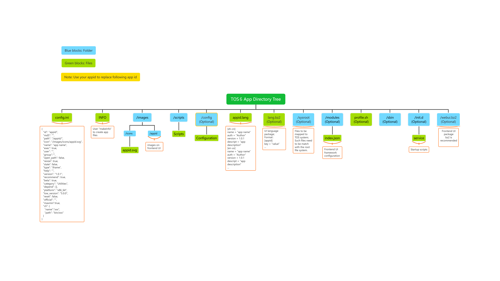

# TOS 5 Application Development Guide - v1.1

## Overview

> The id of the app is the unique identifier of the app; the appid in the document all represents the id of the app.
> 

## 1、config.ini：Configuration file: config.ini (required)

#### config.ini is in json format
```json
{
  "id": "appid", 
  "md5": "",
  "path": "/appid/",
  "icon": "/images/icons/appid.svg",
  "name": "app name",
  "exec": true,
  "user": "",
  "group": "",
  "open_path": false,
  "resize": true,
  "state": false,
  "type": "iframe",
  "help": "",
  "version": "2.4.8",
  "recommend": true,
  "beta": true,
  "category": "Utilities",
  "depend": [],
  "platform": "x86_64",
  "low_version": "5.0.0",
  "reset": false,
  "official": "",
  "maxmin":true,
  "cli": {
    "name":"xxx",
    "path": "bin/xxx"
  }
}

```
#### Field Description

`id` : The unique feature of the app, which can only be composed of uppercase and lowercase letters and numbers, namely appid

`md5` : Leave blank by default, the packaging tool will automatically generate the md5 value

`path` : The default entry path for the app. By default, a path named with the app id is generated in the root directory of the app

`icon` : The path where the app's desktop icon is stored. The default is at  _site/images/icons/appid.svg_

`name` : The name of the app. Can be left blank, the system will automatically load the name from appid.lang

`exec` : Whether the app has a startup script, value: true/false

`user`: Create and specify a user to run the app; Leave blank to use the default user

`group`: Create and specify a user group for the user you created; Leave blank to use the default group (allusers)

`open_path` : Whether the app needs to be opened in a new window, value: true/false

`resize` : Used to define whether the front-end pop-up window can be resized; This is only valid when a non-new window is opened

`maxmin` : Used to define whether the front-end popup window can be maximized or minimized; this is only valid when the app does not open with a new window

`state` : Default value: false, no need to modify

`type` : use default: iframe

`help` : the URL of the app's help documentation; if it does not exist, leave it blank

`version` : the version information of the app

`recommend` : Marks whether the app is a recommended app. Value: true/false

`beta` : mark whether the app is a beta version; value: true/false

`category` : The category of the app. There are 6 values:   Utilities, Security, Multimedia, Development_tools, Business, Backup

`depend` : Whether the operation of the app depends on other applications, fill in the id of the dependent application here. For example: if the app needs to rely on mysql, fill in ["mysql"]

`platform` : The platform to run on. Value: x86_64/aarch64

`low_version` : Defines the minimum requirement for the TOS version. Apps are only available to compliant TOS systems

`reset` : Whether the app has a reset function, value: true/false

`official` : the official website of the application

`cli` : When the app is a command-line tool, it is used to register it with the routing of the TOS system


## 2. init.d/service: startup script

> Optional; This script is valid only when the exec value in config.ini is true;
The path and filename are fixed, and apps that do not require a startup script can ignore this option; the following is an example of the format of a standard startup script:

```shell
#!/bin/bash

#Load system global environment variables
source /etc/profile >/dev/null

#Read the installation location of the current application
InstallPath=$(dirname $(dirname $(readlink -f $0)))

#Switch the current location to the installation directory of the app
cd $InstallPath

service_init() {
    # If the application needs to store data, 
    # Please use the system interface to create an application-owned shared directory
    ter_share_add -name XXX -owner YYY
    # -name: The name of the directory where the data is stored
    # -owner: The owner of the allocation directory, the default is super user
    # return: Returns the absolute path of the directory
}

service_start() {
    service_init
    # service start
}

service_stop() {

}

service_restart() {

}

service_status() {
    #if app running, print running
    #if app stopped, print stopped
}

#If the reset value in config.ini is true, please add this method:
service_reset() {

}

#If the app occupies the system port, please add this method:
service_getport() {

}

case $1 in

start)
    service_start
    ;;
stop)
    service_stop
    ;;
restart)
    service_restart
    ;;
status)
    service_status
    ;;
reset)
    service_reset
    ;;
getport)
    service_getport
    ;;
*)
    echo "usage: name {start|stop|restart|status|reset}"
    exit 1
    ;;
esac
exit $?
```

## 3. Related scripts in the directory scripts

> Optional; Used to store some scripts related to starting the service. When there are no other scripts, this directory may not be needed;

## 4. Directory sbin, bin, lib

>Optional; used to store binary programs or dependent libraries necessary for the app; when there are no binary files, these directories are not required;

## 5. Directory images

> There must be an icons subdirectory for storing appid.png or appid.svg;
If the front-end UI needs other icons or images, the icons or images must be stored in the appid subdirectory under this directory (used to isolate the icons that the application depends on), the directory structure is as follows:

```
├── images
│   ├── appid
│   │   └── *.svg #Store the icons or images required by the front end
│   └── icons
│       └── appid.png
```

## 6. Directory config

> Used to hold some other configuration related to the app; As long as the startup script can load and configure them.

## 7. Multilingual configuration of app name and description

> appid.lang, the format is as follows:

```
[zh-cn]
name = "app name" # app name
auth = "TerraMaster" # developer
version = 2.4.8 #App version
description = "" #App description

[zh-hk]
name = "app name"
auth = "TerraMaster"
version = 2.4.8
descript = ""

[en-us]
name = "app name"
auth = "TerraMaster"
version = 2.4.8
descript = ""

...and some other languages, here is a list of some of the existing languages:

zh-cn
zh-hk
en-us
fr-fr 
de-de
it-it
es-es
hu-hu
ja-jp
ko-kr
pl-pl
ru-ru
tr-tr
pt-pt

You can choose to add other languages
```

## 8. A detailed explanation of webui.bz2

> Inside the tar package is the front-end interface of the app.
It is in the form of a tar package to ensure the integrity of the updated application.

## 9. A detailed explanation of lang.bz2

> The tar package contains the translation of the front-end interface of the application. The structure is as follows:

```
./
./hu-hu/
./hu-hu/appid.lang
./pt-pt/
./pt-pt/appid.lang
./fr-fr/
./fr-fr/appid.lang
./ko-kr/
./ko-kr/appid.lang
./pl-pl/
./pl-pl/appid.lang
./zh-hk/
./zh-hk/appid.lang
./en-us/
./en-us/appid.lang
./de-de/
./de-de/appid.lang
./es-es/
./es-es/appid.lang
./ru-ru/
./ru-ru/appid.lang
./it-it/
./it-it/appid.lang
./ja-jp/
./ja-jp/appid.lang
./zh-cn/
./zh-cn/appid.lang
./tr-tr/
./tr-tr/appid.lang
```

```
The language document format is a standard ini file, the format is as follows:

[appid]
key1 = "value"
key2 = "value"
key3 = "value"
...
```

## 10. Directory modules

> Used to store the index.json configuration file; this directory is related to the front-end UI, and applications without UI can ignore it; the format is as follows:

```
[
    {
        "id": "appid_key1",
        "icon": "/images/appid/key1.svg",
        "name": ["appid","key1"],
        "type": "iframe",
        "path": "/",
        "is_delete": true,
        "role": ["root","default"]
    },
    {
        "id": "appid_key2",
        "icon": "/images/appid/key2.svg",
        "name": ["appid","key2"],
        "type": "iframe",
        "is_delete": true,
        "path": "/key2",
        "role": ["root","default"]
    },
    {
        "id": "appid_key3",
        "icon": "/images/appid/key3.svg",
        "name": ["appid","key3"],
        "type": "iframe",
        "path": "/key3",
        "is_delete": true,
        "role": ["root","default"]
    }
]
```
#### Field Description
`id` : the unique identifier of the app function module;

`icon` : the icon displayed by the app function module, the storage location refers to the description of "directory images";

`name` : The translation variable of the name of the app function module, please refer to the description of "lang.bz2";

`type` : default: iframe;

`path` : is the front-end route corresponding to the function;

`is_delete` : default: true;

`role` : indicates which users are allowed to control the function module, root indicates administrator, default is non-administrator, or both can be assigned;

## 11, profile.sh: global environment variable configuration

> Optional; the format is as follows:

```shell
#!/bin/bash
AppRoot=$(dirname $(readlink -f "${BASH_SOURCE[0]}"))
AppBin="${AppRoot}/bin"

if [ ! -d $AppBin ]; then
  return 1
fi

export PATH="${PATH}:${AppBin}"
```

## 12. Map to TOS configuration (sysroot directory)

>Optional; when installing the app, link all the files in this directory to the corresponding directory in the TOS system; this option is valid for those dependent libraries that cannot be found.
Note: Lazy configuration is not recommended (that is, put the entire application in this directory for mapping)
